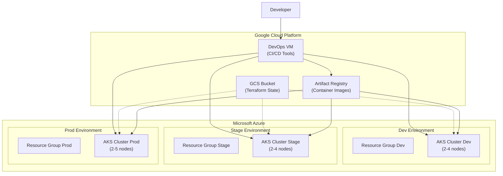
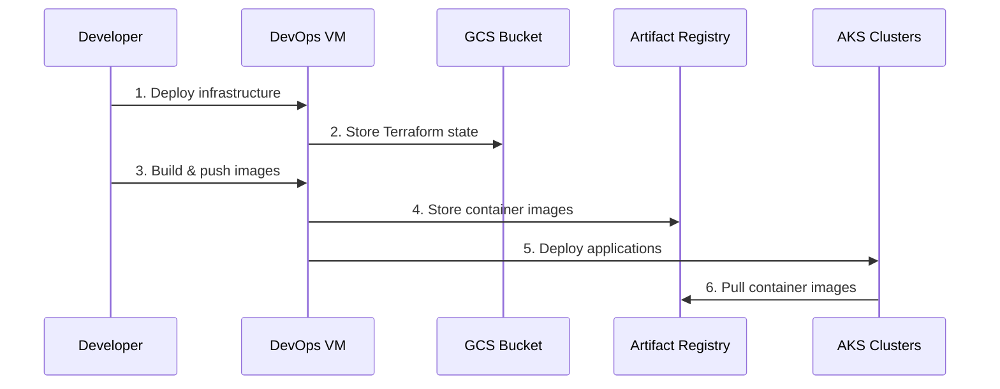
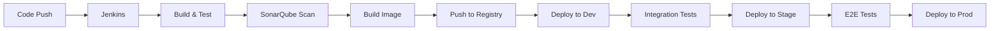

# 🏗️ Infraestructura EcommerceCoZam

Repositorio de infraestructura como código (IaC) para el proyecto [EcommerceCoZam](https://github.com/EstebanCoZam/ecommerce-microservice-backend-app) usando Terraform con arquitectura híbrida Azure-GCP.

## 🎯 Arquitectura General



## 📋 Componentes de la Infraestructura

| Componente | Proveedor | Propósito | Estado |
|------------|-----------|-----------|--------|
| **GCS Bucket** | GCP | Backend Terraform State | ✅ |
| **Artifact Registry** | GCP | Container Registry | ✅ |
| **DevOps VM** | GCP | CI/CD Tools | ✅ |
| **AKS Dev** | Azure | Desarrollo | ✅ |
| **AKS Stage** | Azure | Staging | ✅ |
| **AKS Prod** | Azure | Producción | ✅ |

## 📁 Estructura del Repositorio

```
infrastructure/
├── 📘 README.md                           # Esta documentación
├── 📂 shared/                             # Recursos compartidos
│   ├── 📂 gcp-bucket/                     # Backend Terraform State
│   ├── 📂 gcp-registry/                   # Container Registry
│   └── 📂 vm-devops/                      # VM para herramientas DevOps
├── 📂 environments/                       # Ambientes por separado
│   ├── 📂 dev/                           # Ambiente desarrollo
│   ├── 📂 stage/                         # Ambiente staging
│   └── 📂 prod/                          # Ambiente producción
├── 📂 modules/                           # Módulos reutilizables
│   ├── 📂 aks/                           # Módulo AKS
│   └── 📂 vm-devops/                     # Módulo VM DevOps
├── 📂 helm/                              # Charts Kubernetes
└── 📂 scripts/                           # Scripts de automatización
```

## ⚡ Quick Start

### 1. Prerrequisitos
```bash
# Verificar herramientas instaladas
terraform --version  # >= 1.0
az --version         # Azure CLI
gcloud --version     # Google Cloud SDK
kubectl version      # Kubernetes CLI
helm version         # Helm >= 3.0
```

### 2. Configurar Autenticación
```bash
# Azure
az login
az account set --subscription <subscription-id>

# Google Cloud
gcloud auth login
gcloud config set project certain-perigee-459722-b4
gcloud auth application-default login
```

### 3. Despliegue Completo
```bash
# Usar script de despliegue rápido
./scripts/quick-deploy.sh

# O paso a paso:
cd shared/gcp-bucket && terraform apply
cd ../gcp-registry && terraform apply
cd ../vm-devops && terraform apply
cd ../../environments/dev && terraform apply
cd ../stage && terraform apply
cd ../prod && terraform apply
```

### 4. Verificar Estado
```bash
./scripts/quick-status.sh
```

## 🔧 Flujo de Datos



## 🌐 Ambientes

### Configuración por Ambiente

| Ambiente | Nodos | VM Size | Propósito |
|----------|--------|---------|-----------|
| **Dev** | 2-4 | Standard_B2s | Desarrollo y pruebas |
| **Stage** | 2-4 | Standard_B2s | Testing pre-producción |
| **Prod** | 2-5 | Standard_DS2_v2 | Aplicaciones en vivo |

### URLs de Acceso (Helm)
```bash
# Desarrollo
http://ecommerce-dev.local

# Staging  
http://ecommerce-stage.local

# Producción
http://ecommerce.example.com
```

## 💰 Estimación de Costos (USD/mes)

| Componente | Dev | Stage | Prod | Total |
|------------|-----|-------|------|-------|
| **AKS Clusters** | $60 | $60 | $150 | $270 |
| **DevOps VM** | $120 | - | - | $120 |
| **Storage (GCS)** | <$5 | - | - | $5 |
| **Registry** | <$10 | - | - | $10 |
| **Total** | **$195** | **$60** | **$150** | **$405** |

## 🔐 Seguridad y Acceso

### Control de Acceso
- **RBAC**: Configurado en todos los clusters AKS
- **Network Security**: Firewall rules en GCP
- **Secrets**: Gestión nativa de Kubernetes
- **TLS**: Configurado para servicios públicos

### Autenticación
```bash
# Conectar a AKS
az aks get-credentials --resource-group <rg-name> --name <cluster-name>

# Verificar acceso
kubectl get nodes
```

## 📊 Observabilidad

### Stack de Monitoreo (Helm)
- **Prometheus**: Métricas
- **Grafana**: Dashboards
- **Zipkin**: Distributed tracing
- **ELK Stack**: Logs centralizados

### Health Checks
- **Liveness Probes**: `/actuator/health`
- **Readiness Probes**: `/actuator/health`
- **Startup Probes**: Configurado por servicio

## 🚀 CI/CD Pipeline

### Herramientas DevOps (VM)
| Herramienta | Puerto | Propósito |
|-------------|--------|-----------|
| **Jenkins** | 8080 | CI/CD Pipeline |
| **SonarQube** | 9000 | Code Quality |
| **Grafana** | 3000 | Monitoring |
| **Prometheus** | 9090 | Metrics |
| **ArgoCD** | 8090 | GitOps |

### Pipeline Flow


## 🛠️ Comandos Útiles

### Terraform
```bash
# Ver estado completo
./scripts/quick-status.sh

# Planificar cambios
cd environments/dev && terraform plan

# Destruir todo
./scripts/quick-destroy.sh
```

### Kubernetes
```bash
# Cambiar contexto
kubectl config use-context <cluster-name>

# Ver recursos por namespace
kubectl get all -n microservices

# Port forward para debugging
kubectl port-forward svc/api-gateway 8080:8222 -n microservices
```

### Helm
```bash
# Ver aplicaciones desplegadas
helm list -A

# Estado de un release
helm status ecommerce-app-dev -n ecommerce

# Ver logs
./helm/logs.sh dev api-gateway
```

## 📚 Documentación Detallada

- **[Shared Resources](./shared/)**: GCS, Registry, DevOps VM
- **[Environments](./environments/)**: Dev, Stage, Prod
- **[Modules](./modules/)**: Componentes reutilizables
- **[Helm Charts](./helm/)**: Despliegue de aplicaciones

## 🚨 Troubleshooting

### Problemas Comunes

**Error: Terraform state locked**
```bash
terraform force-unlock <LOCK_ID>
```

**Error: AKS cluster unreachable**
```bash
az aks get-credentials --resource-group <rg> --name <cluster> --overwrite-existing
```

**Error: Container images not found**
```bash
# Verificar registry
gcloud auth configure-docker us-central1-docker.pkg.dev
```

### Logs y Debugging
```bash
# Terraform debugging
export TF_LOG=DEBUG

# Kubernetes events
kubectl get events --sort-by='.lastTimestamp' -A

# Pod logs
kubectl logs -f <pod-name> -n <namespace>
```

## 🤝 Contribución

1. Fork el repositorio
2. Crear rama feature: `git checkout -b feature/nueva-funcionalidad`
3. Commit cambios: `git commit -am 'Agregar nueva funcionalidad'`
4. Push rama: `git push origin feature/nueva-funcionalidad`
5. Crear Pull Request

## 📝 Notas Importantes

- ⚠️ **Los archivos `terraform.tfvars` NO están versionados** (contienen datos sensibles)
- 🔒 **El bucket GCS debe crearse ANTES que los clusters AKS**
- 💰 **Revisar costos periódicamente** en Azure y GCP
- 🔄 **Usar backend remoto** para estado de Terraform en equipo

---

**Mantenido por**: [EstebanCoZam](https://github.com/EstebanCoZam)  
**Última actualización**: Junio 2025 
**Versión**: 3.0