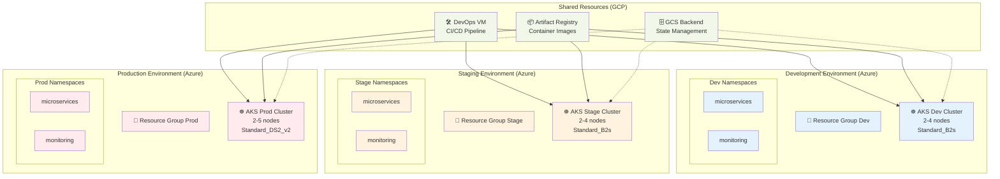
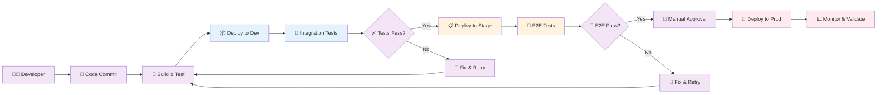
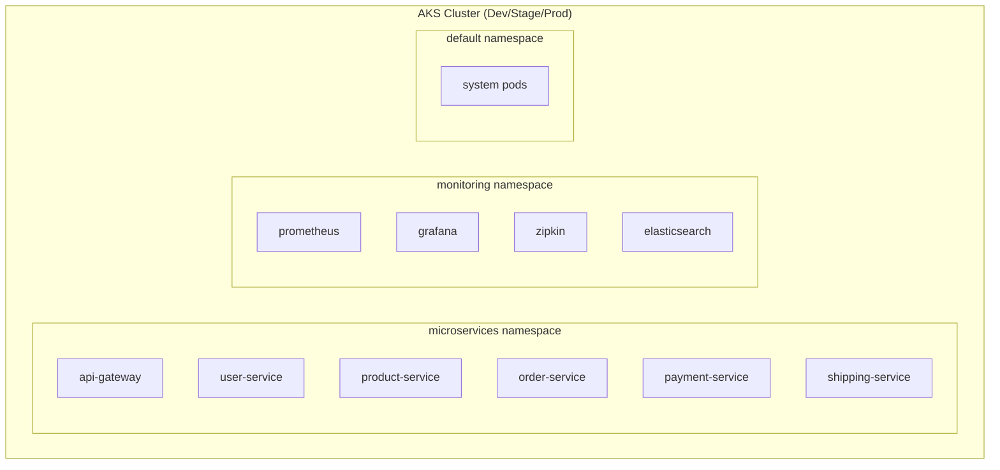
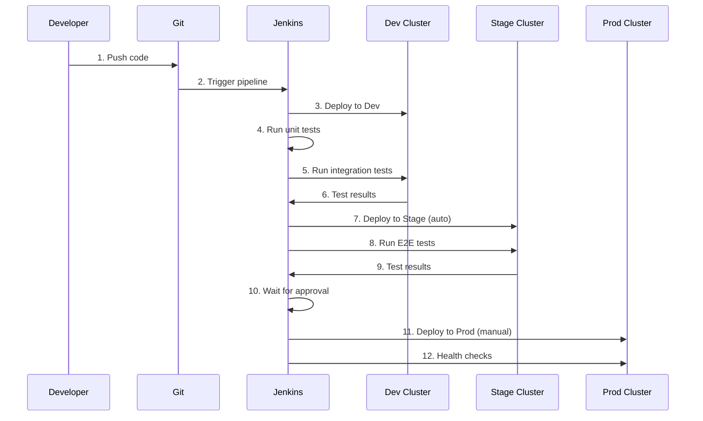
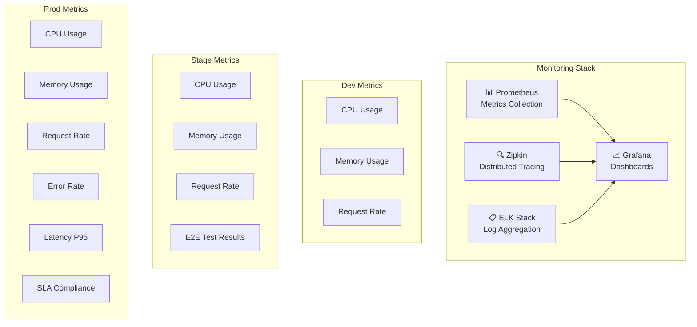

# 🌍 Environments

Configuración de ambientes separados para el ciclo de vida de desarrollo de EcommerceCoZam.

## 🎯 Arquitectura Multi-Ambiente



## 📊 Configuración por Ambiente

| Característica | Dev | Stage | Prod |
|----------------|-----|-------|------|
| **Nodos** | 2-4 | 2-4 | 2-5 |
| **VM Size** | Standard_B2s | Standard_B2s | Standard_DS2_v2 |
| **Disk Size** | 64GB | 64GB | 128GB |
| **Auto-scaling** | ✅ | ✅ | ✅ |
| **Monitoring** | Basic | Basic | Enhanced |
| **Backup** | No | Weekly | Daily |
| **SLA** | - | 95% | 99.9% |

## 🚀 Pipeline de Promoción



## 📂 Estructura de Directorios

```
environments/
├── dev/                          # Ambiente de desarrollo
│   ├── main.tf                   # Configuración principal
│   ├── variables.tf               # Variables específicas
│   ├── outputs.tf                 # Outputs del ambiente
│   ├── terraform.tfvars.example   # Template de variables
│   └── README.md                  # Documentación específica
├── stage/                        # Ambiente de staging
│   ├── main.tf
│   ├── variables.tf
│   ├── outputs.tf
│   ├── terraform.tfvars.example
│   └── README.md
└── prod/                         # Ambiente de producción
    ├── main.tf
    ├── variables.tf
    ├── outputs.tf
    ├── terraform.tfvars.example
    └── README.md
```

## 🔧 Configuración y Despliegue

### 1. Variables por Ambiente

Cada ambiente requiere su archivo `terraform.tfvars`:

**dev/terraform.tfvars**:
```hcl
# Azure
subscription_id       = "your-subscription-id"
tenant_id            = "your-tenant-id"
resource_group_name  = "rg-ecommerce-dev"
location             = "East US"

# AKS
cluster_name         = "aks-ecommerce-dev"
dns_prefix          = "ecommerce-dev"
node_count          = 2
vm_size             = "Standard_B2s"
node_pool_min_count = 2
node_pool_max_count = 4

# GCP
gcp_project_id      = "certain-perigee-459722-b4"
gcp_region          = "us-central1"
```

**stage/terraform.tfvars**:
```hcl
# Similar a dev pero con nombres stage
resource_group_name = "rg-ecommerce-stage"
cluster_name       = "aks-ecommerce-stage"
dns_prefix         = "ecommerce-stage"
```

**prod/terraform.tfvars**:
```hcl
# Configuración de producción
resource_group_name = "rg-ecommerce-prod"
cluster_name       = "aks-ecommerce-prod"  
dns_prefix         = "ecommerce-prod"
vm_size            = "Standard_DS2_v2"
node_pool_max_count = 5
node_os_disk_size_gb = 128
```

### 2. Secuencia de Despliegue

```bash
# 1. Desplegar shared resources primero
cd shared/gcp-bucket && terraform apply
cd ../gcp-registry && terraform apply  
cd ../vm-devops && terraform apply

# 2. Desplegar ambientes en orden
cd ../../environments/dev && terraform apply
cd ../stage && terraform apply
cd ../prod && terraform apply
```

### 3. Validación Post-Despliegue

```bash
# Verificar clusters AKS
az aks list --output table

# Conectar a cada cluster
az aks get-credentials --resource-group rg-ecommerce-dev --name aks-ecommerce-dev
az aks get-credentials --resource-group rg-ecommerce-stage --name aks-ecommerce-stage  
az aks get-credentials --resource-group rg-ecommerce-prod --name aks-ecommerce-prod

# Verificar nodos
kubectl get nodes --context aks-ecommerce-dev
kubectl get nodes --context aks-ecommerce-stage
kubectl get nodes --context aks-ecommerce-prod
```

## 🔐 Gestión de Contextos Kubernetes

### Configuración de Contextos
```bash
# Listar contextos disponibles
kubectl config get-contexts

# Cambiar entre ambientes
kubectl config use-context aks-ecommerce-dev
kubectl config use-context aks-ecommerce-stage
kubectl config use-context aks-ecommerce-prod

# Verificar contexto actual
kubectl config current-context
```

### Alias Útiles
```bash
# Agregar a ~/.bashrc o ~/.zshrc
alias k-dev='kubectl config use-context aks-ecommerce-dev'
alias k-stage='kubectl config use-context aks-ecommerce-stage'
alias k-prod='kubectl config use-context aks-ecommerce-prod'

# Verificaciones rápidas
alias k-nodes='kubectl get nodes'
alias k-pods='kubectl get pods -A'
alias k-status='kubectl get all -A'
```

## 🏗️ Namespaces por Ambiente

Cada cluster AKS tiene namespaces organizados:



### Comandos por Namespace
```bash
# Ver recursos en microservices
kubectl get all -n microservices

# Ver recursos en monitoring
kubectl get all -n monitoring

# Crear port-forward para debugging
kubectl port-forward svc/api-gateway 8080:8222 -n microservices
kubectl port-forward svc/grafana 3000:3000 -n monitoring
```

## 🚦 Promoción entre Ambientes

### Flujo Automatizado (CI/CD)



### Promoción Manual

```bash
# 1. Validar en Dev
kubectl config use-context aks-ecommerce-dev
kubectl get pods -n microservices
curl http://dev-api-gateway/health

# 2. Promover a Stage
kubectl config use-context aks-ecommerce-stage
helm upgrade ecommerce-app-stage ./helm/ecommerce-app -f values-stage.yaml

# 3. Validar en Stage
kubectl get pods -n microservices
curl http://stage-api-gateway/health

# 4. Promover a Prod (con aprobación)
kubectl config use-context aks-ecommerce-prod
helm upgrade ecommerce-app-prod ./helm/ecommerce-app -f values-prod.yaml
```

## 💰 Costos por Ambiente (USD/mes)

| Recurso | Dev | Stage | Prod | Total |
|---------|-----|-------|------|-------|
| **AKS Cluster** | $60 | $60 | $150 | $270 |
| **Storage** | $5 | $10 | $20 | $35 |
| **Load Balancer** | $20 | $20 | $40 | $80 |
| **Monitoring** | $0 | $10 | $30 | $40 |
| **Backup** | $0 | $5 | $15 | $20 |
| **Total** | **$85** | **$105** | **$255** | **$445** |

### Optimización de Costos

**Dev Environment**:
- ⏰ Auto-shutdown durante noches/fines de semana
- 🔄 Usar Spot instances cuando sea posible
- 🗂️ Cleanup automático de recursos temporales

**Stage Environment**:
- 📊 Monitoreo básico (sin alertas 24/7)
- 🔄 Scheduled scaling (scale-down en off-hours)
- 📱 Backup weekly

**Prod Environment**:
- 🚨 Monitoreo completo con alertas
- 🔄 Auto-scaling agresivo
- 💾 Backup diario con retención
- 🛡️ Multi-zone para HA

## 🔍 Monitoreo y Observabilidad

### Métricas por Ambiente



### Dashboards por Ambiente

**Development**:
- 🔧 Development metrics
- 📊 Build pipeline status
- 🧪 Test coverage reports

**Staging**:
- 📈 Performance benchmarks
- 🎯 E2E test results
- 🔄 Deployment frequency

**Production**:
- 🚨 Critical alerts dashboard
- 📊 Business metrics
- 🛡️ Security monitoring
- 💰 Cost tracking

## 🚨 Troubleshooting por Ambiente

### Problemas Comunes

**Development**:
```bash
# Pod failures
kubectl describe pod <pod-name> -n microservices
kubectl logs <pod-name> -n microservices --previous

# Resource issues
kubectl top nodes
kubectl top pods -n microservices
```

**Staging**:
```bash
# E2E test failures
kubectl logs -l app=e2e-tests -n microservices
kubectl get events --sort-by='.lastTimestamp' -n microservices

# Performance issues
kubectl exec -it <pod-name> -n microservices -- top
```

**Production**:
```bash
# Critical issues
kubectl get pods -n microservices --field-selector=status.phase!=Running
kubectl get events --field-selector type=Warning -n microservices

# Emergency scaling
kubectl scale deployment api-gateway --replicas=10 -n microservices
```

### Scripts de Diagnóstico

```bash
#!/bin/bash
# health-check.sh - Verificar salud de ambiente

ENVIRONMENT=$1
NAMESPACE="microservices"

echo "🔍 Health Check para ambiente: $ENVIRONMENT"

# Cambiar contexto
kubectl config use-context aks-ecommerce-$ENVIRONMENT

# Verificar nodos
echo "📊 Estado de nodos:"
kubectl get nodes

# Verificar pods
echo "🔧 Estado de pods:"
kubectl get pods -n $NAMESPACE

# Verificar servicios
echo "🌐 Estado de servicios:"
kubectl get svc -n $NAMESPACE

# Verificar recursos
echo "💾 Uso de recursos:"
kubectl top nodes
kubectl top pods -n $NAMESPACE
```

## 🔄 Backup y Recuperación

### Estrategia por Ambiente

**Development**:
- 📸 Snapshots de configuración
- 🔄 Backup de base de datos de desarrollo
- ⏰ Frecuencia: Manual/As needed

**Staging**:
- 📸 Snapshots semanales
- 🔄 Backup de datos de testing
- ⏰ Frecuencia: Weekly

**Production**:
- 📸 Snapshots diarios
- 🔄 Backup incremental
- 🛡️ Cross-region replication
- ⏰ Frecuencia: Daily + Real-time for critical data

### Procedimientos de Recuperación

```bash
# Rollback de deployment
helm rollback ecommerce-app-prod <revision> -n microservices

# Restore desde backup
kubectl apply -f backup/prod-snapshot-YYYY-MM-DD.yaml

# Disaster recovery
./scripts/disaster-recovery.sh --environment prod --restore-point YYYY-MM-DD
```


## ✅ Checklist de Ambiente

### Pre-Deployment
- [ ] Shared resources desplegados
- [ ] Variables configuradas en terraform.tfvars
- [ ] Credenciales Azure configuradas
- [ ] Credenciales GCP configuradas

### Post-Deployment
- [ ] Cluster AKS accesible
- [ ] Namespaces creados correctamente
- [ ] Nodos en estado Ready
- [ ] Networking funcionando
- [ ] Monitoreo configurado

### Validation
- [ ] Aplicaciones desplegadas
- [ ] Health checks pasando
- [ ] Logs accesibles
- [ ] Métricas recolectándose
- [ ] Alertas configuradas

---

**Nota**: Cada ambiente es independiente pero comparte recursos de la capa "shared". Coordinar cambios en shared resources con todos los ambientes.