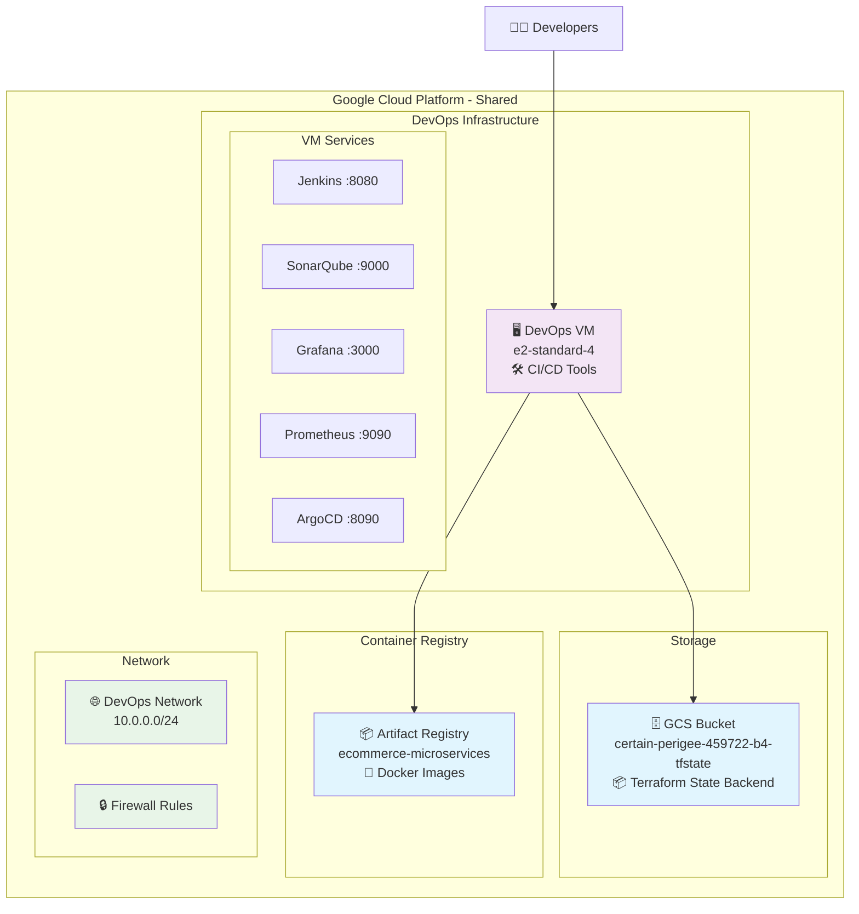
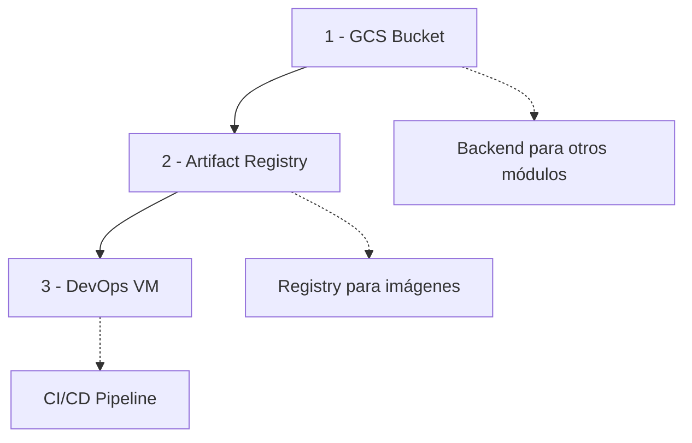
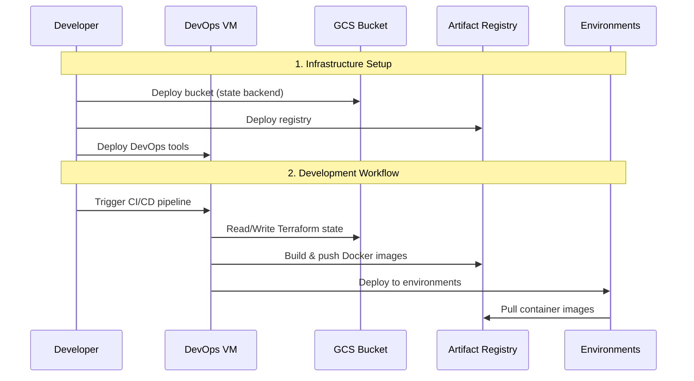

# 🔧 Shared Resources

Recursos compartidos de infraestructura que son utilizados por todos los ambientes del proyecto EcommerceCoZam.

## 🎯 Arquitectura de Shared Resources



## 📂 Componentes

### 1. GCS Bucket (`gcp-bucket/`)
**Propósito**: Backend remoto para almacenar el estado de Terraform

**Características**:
- ✅ Versionado habilitado
- 🔒 Uniform bucket-level access
- 🛡️ Protect against deletion
- 📊 Lifecycle rules configuradas

**Configuración**:
```hcl
bucket_name = "certain-perigee-459722-b4-tfstate"
location    = "US"
storage_class = "STANDARD"
```

### 2. Artifact Registry (`gcp-registry/`)
**Propósito**: Registro privado de imágenes Docker para microservicios

**Características**:
- 🐳 Formato Docker
- 🔐 IAM controlado
- 🌎 Multi-región (us-central1)
- 🏷️ Labels organizacionales

**Configuración**:
```hcl
repository_name = "ecommerce-microservices"
location       = "us-central1"
format         = "DOCKER"
```

### 3. DevOps VM (`vm-devops/`)
**Propósito**: Máquina virtual con herramientas de CI/CD

**Especificaciones**:
- 💻 Machine Type: `e2-standard-4` (4 vCPUs, 16GB RAM)
- 💾 Disk: 100GB SSD
- 🌐 Static IP reservada
- 🔧 Pre-instalado: Docker, Kubectl, Helm

## 🚀 Orden de Despliegue

Los shared resources deben desplegarse en este orden específico:



### Script de Despliegue Automático
```bash
#!/bin/bash
echo "🚀 Desplegando Shared Resources..."

cd shared/gcp-bucket && terraform apply -auto-approve
cd ../gcp-registry && terraform apply -auto-approve  
cd ../vm-devops && terraform apply -auto-approve

echo "✅ Shared Resources desplegados"
```

## 🔐 Configuración de Acceso

### Variables Requeridas

Cada directorio necesita un archivo `terraform.tfvars`:

**gcp-bucket/terraform.tfvars**:
```hcl
project_id    = "certain-perigee-459722-b4"
region        = "us-central1"
bucket_name   = "certain-perigee-459722-b4-tfstate"
force_destroy = false  # ⚠️ Protección en producción
```

**gcp-registry/terraform.tfvars**:
```hcl
project_id      = "certain-perigee-459722-b4"
repository_name = "ecommerce-microservices"
location        = "us-central1"
```

**vm-devops/terraform.tfvars**:
```hcl
gcp_project_id = "certain-perigee-459722-b4"
gcp_region     = "us-east1"
zone           = "us-east1-b"
vm_name        = "ecommerce-devops-vm"

ssh_users = {
  devops = {
    username   = "devops"
    public_key = "ssh-rsa AAAAB3NzaC1yc2E... your-public-key"
  }
}
```

## 🌊 Flujo de Datos



## 💰 Costos Estimados (USD/mes)

| Recurso | Especificación | Costo/mes |
|---------|----------------|-----------|
| **GCS Bucket** | <1GB Standard | <$0.05 |
| **Artifact Registry** | <10GB storage | <$10 |
| **DevOps VM** | e2-standard-4 | ~$120 |
| **Static IP** | 1 IP reservada | $1.5 |
| **Network** | Firewall rules | $0 |
| **Total** | - | **~$131** |

## 🔧 Operaciones Comunes

### Verificar Estado
```bash
# Estado de todos los shared resources
./scripts/quick-status.sh

# Estado específico
cd shared/gcp-bucket && terraform show
cd shared/gcp-registry && terraform show  
cd shared/vm-devops && terraform show
```

### Conectar a DevOps VM
```bash
# SSH connection
gcloud compute ssh ecommerce-devops-vm --zone=us-east1-b

# O usando IP externa
ssh devops@<EXTERNAL_IP>
```

### Acceder a Servicios DevOps
```bash
# URLs (reemplazar <EXTERNAL_IP> con la IP real)
Jenkins:    http://<EXTERNAL_IP>:8080
SonarQube:  http://<EXTERNAL_IP>:9000  
Grafana:    http://<EXTERNAL_IP>:3000
Prometheus: http://<EXTERNAL_IP>:9090
ArgoCD:     http://<EXTERNAL_IP>:8090
```

### Configurar Docker Registry
```bash
# Autenticar Docker con Artifact Registry
gcloud auth configure-docker us-central1-docker.pkg.dev

# Build y push de imagen
docker build -t us-central1-docker.pkg.dev/certain-perigee-459722-b4/ecommerce-microservices/api-gateway:latest .
docker push us-central1-docker.pkg.dev/certain-perigee-459722-b4/ecommerce-microservices/api-gateway:latest
```

## 🚨 Troubleshooting

### Problemas Comunes

**Error: Bucket already exists**
```bash
# Cambiar nombre del bucket
bucket_name = "certain-perigee-459722-b4-tfstate-$(date +%s)"
```

**Error: Permission denied en VM**
```bash
# Verificar SSH keys
gcloud compute instances describe ecommerce-devops-vm --zone=us-east1-b

# Re-generar SSH key
ssh-keygen -t rsa -b 4096 -C "your-email@example.com"
```

**Error: Registry access denied**
```bash
# Re-autenticar
gcloud auth configure-docker us-central1-docker.pkg.dev
gcloud auth application-default login
```

### Logs y Debugging
```bash
# Terraform debug
export TF_LOG=DEBUG
terraform apply

# GCP logs
gcloud logging read "resource.type=gce_instance" --limit=50

# VM startup logs
gcloud compute instances get-serial-port-output ecommerce-devops-vm --zone=us-east1-b
```

## 🔄 Mantenimiento

### Tareas Periódicas

**Semanalmente**:
- 📊 Revisar uso de storage en GCS
- 🐳 Limpiar imágenes antiguas en Registry
- 💻 Verificar estado de DevOps VM

**Mensualmente**:
- 💰 Analizar costos de GCP
- 🔄 Actualizar herramientas en DevOps VM
- 🧹 Limpiar logs antiguos

**Trimestralmente**:
- 🔐 Rotar claves SSH
- 📋 Auditar permisos IAM
- 🏷️ Actualizar labels y tags

### Scripts de Mantenimiento
```bash
# Cleanup de imágenes antiguas
gcloud container images list-tags us-central1-docker.pkg.dev/certain-perigee-459722-b4/ecommerce-microservices \
  --filter="timestamp.datetime < '-30d'" --format="get(digest)" | \
  xargs -I {} gcloud container images delete us-central1-docker.pkg.dev/certain-perigee-459722-b4/ecommerce-microservices@{}

# Verificar estado del bucket
gsutil du -s gs://certain-perigee-459722-b4-tfstate
```

## 📚 Referencias

- **[GCS Backend Documentation](https://developer.hashicorp.com/terraform/language/settings/backends/gcs)**
- **[Artifact Registry Guide](https://cloud.google.com/artifact-registry/docs)**
- **[Compute Engine Best Practices](https://cloud.google.com/compute/docs/instances/best-practices)**

---

**Nota**: Estos recursos son la base de toda la infraestructura. Cualquier cambio debe ser coordinado con el equipo.